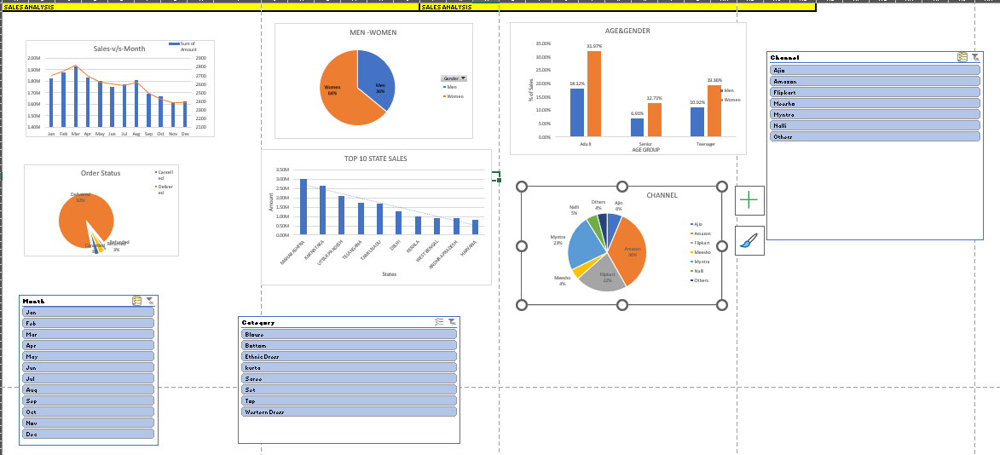

# Sales Data Analysis and Visualization

## Description
This project explores sales data using Excel and Power BI, with the goal of identifying trends in customer demographics, regional performance, and platform contributions. The analysis includes pivot tables, charts, and an interactive dashboard with slicers for dynamic insights.

## Data
- **Dataset:** Raw sales data (included in `RAW_DATA.xlsx')  
- **Columns:** Customer Gender, Age, State, Product, Platform, Sales Amount, etc.

## Methodology
1. **Data Cleaning:** Handled missing values, formatted columns, and derived additional fields such as age group and month using Excel formulas (`IF`, `TEXT`).  
2. **Exploratory Analysis:** Created pivot tables and charts to summarize sales by gender, age group, state, and platform.  
3. **Visualization:** Built an interactive Power BI dashboard with slicers and filters for dynamic analysis.

## Dashboard Screenshot

## Key Insights
- **Customer Gender:** Women account for ~65% of total sales.  
- **Top States:** Maharashtra, Karnataka, and Uttar Pradesh lead in sales contribution.  
- **Age Group:** Adults aged 30–49 are the highest contributing segment.  
- **Platforms:** Amazon, Flipkart, and Myntra contribute the most to sales.

## Recommendations
- Focus marketing and advertising efforts in **Maharashtra, Karnataka, and Uttar Pradesh**.  
- Target campaigns toward **women aged 30–49**, as they drive the majority of sales.  
- Prioritize sales channels like **Amazon, Flipkart, and Myntra** for promotions and product placement.

## Skills Used
- Data Cleaning and Transformation in Excel  
- Pivot Tables, Charts, and Slicers  
- Power BI Dashboard Design  

## Conclusion
This analysis highlights the key customer segments, regions, and platforms driving sales. Targeted advertising toward high-performing states and demographics can maximize ROI and improve business outcomes.
